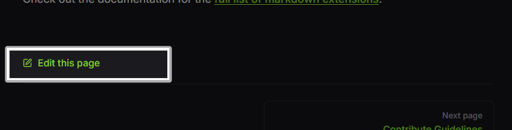
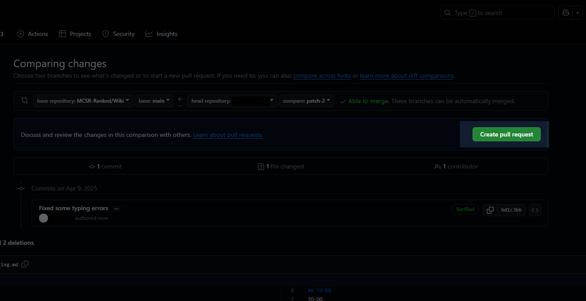
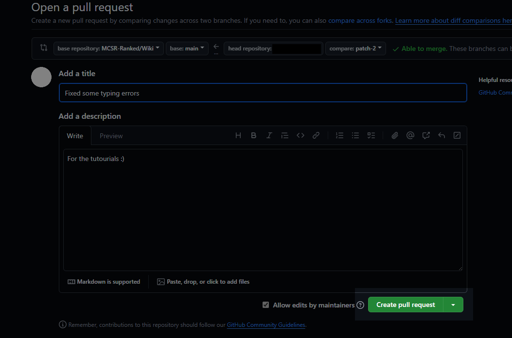

# 编辑页面

## Pull Request
如果你知道如何使用github, 你可以在遵守指南的同时编辑文档，并提交一个Pull Request。

如果你不知道怎么使用github，请跟随下面的步骤进行操作。

## 开始一次编辑

在每个页面的底部, 会有一个“Edit the page”按钮，点击它。 
如果你没有登陆github, 你会跳转到登录界面，确保登陆成功。

### 初次编辑

如果你是第一次编辑页面，会看到上图界面。你需要点击中间的“Fork this repository”

### 编辑页面

现在你可以编辑页面内容了。点击编辑器左上角的“Preview”按钮，即可查看编辑后的内容。如果你在查阅相关格式，请点击[这里](./#markdown-format)。

---

### 创建一个编辑请求

当你完成了编辑，点击编辑器右上角的“Commit changes...”按钮进行提交。

---

然后你会得到这个窗口。 
在“Commit message”里，你必须对你的编辑请求拟定一个标题。标题需言简意赅，能直接体现本次编辑做出的修改。 
当一切完毕，点击“Propose changes”按钮。

---

再点击“Create Pull Request”按钮 

---

现在全部完毕，所做出的更改将在审查过后可见 
如果你想查看审查过程，请查阅[此文档](./review) :)
