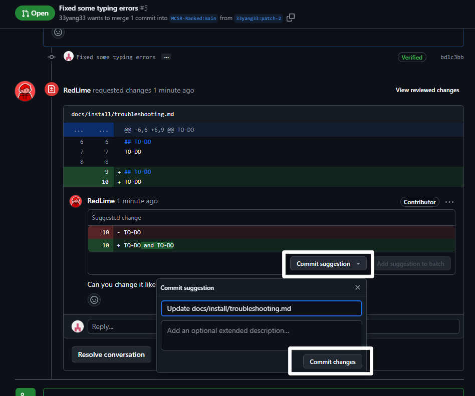

# Request审查

在你创建了一个Pull Request之后，项目拥有者会检查你的Request

如果Request没有问题，所作出的更改就会被同步到网页。 
但是你也许会被要求修改一些内容。

---

你可以根据审查意见来修改你的Request，如果你认为审查意见有所不妥，可以留一条Comment或者在[Discord服务器](https://mcsrranked.com/discord)上讨论

---

如果你得到了拥有者的认可，你所作出的更改就会同步到网页上
