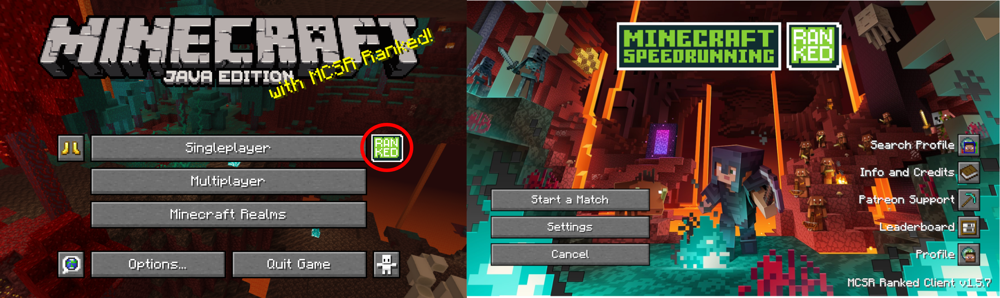
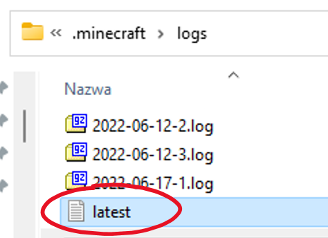
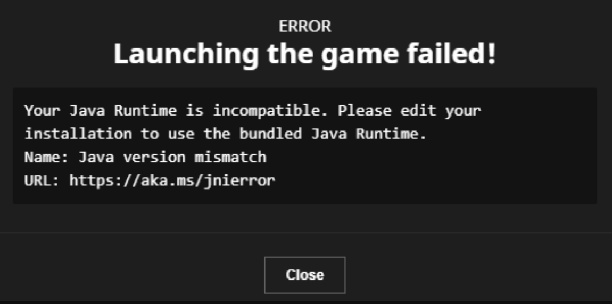

<div style="text-align:center;">
  
</div>

查看右侧的目录，或者按Ctrl+F搜索文档

此文档主要关注Prism、MultiMC启动器和其他启动器的问题，但强烈建议使用Prism或MultiMC启动器。

感谢Ataraxia为本文档原始版本所做的贡献。

::: 提示
  💬 遇到问题？ 请在我们的 [Discord 服务器](https://mcsrranked.com/discord) 中的 <code>#tech-help</code> 频道提问.
:::

# 安装

## 我在哪里可以找到关于Ranked的信息？

- 网站: <https://mcsrranked.com/>
- Discord: <https://discord.gg/nnjUSyDErj>
- 模组下载: <https://modrinth.com/mod/mcsr-ranked/version/latest>
  - 由于大多数速通者都在 Minecraft 1.16.1 上运行，因此这个模组是为 1.16.1 开发的。它不适用于 Minecraft 的其他版本。
- Ranked菜单在游戏中的样子如下:



## 我改如何设置Ranked?

请查看[安装文档](./index)获取说明。

## 我有这些模组，但它们在游戏中没有显示出来（我没有看到Ranked按钮）

您需要安装 Fabric。

如果您正在使用 Prism 启动器：

- 选择您的实例 > 编辑 > 安装加载器 > Fabric。

如果您使用 MultiMC：

- 选择您的实例 > 编辑实例 > 安装 Fabric。

如果您使用默认启动器：

- 按照[这里](https://fabricmc.net/wiki/player:tutorials:install_mcl:windows)的步骤操作,直到第 3 步。不要安装 Fabric API。

## 我该如何更新我的 Java 版本？{#update-java}

- 对于 Prism：遵循此[指南](https://gist.github.com/maskersss/0993754fb91686f78f8c000280699fa4)
- 对于 MultiMC/官方启动器：遵循本[指南](https://docs.google.com/document/d/1PIjyPMulI3r5aZpfywt5OQR_12qEzX5UTfU8DQHtNp8/edit?pli=1&tab=t.0#heading=h.62ygxgaxcs5a)的相关部分

## Ranked按钮变灰且不可点击，鼠标悬停时会显示“...”提示

- 首先，检查Ranked服务器是否宕机（请在 discord 服务器中的#maintenances 查看）。
- 如果服务器没有宕机，请检查您的 Ranked 模组版本是否与最新版本匹配。 转到你的 [模组文件夹](#find-minecraft) 检查 `mcsrranked` 模组版本号, 对比 [最新版本](https://modrinth.com/mod/mcsr-ranked/version/latest)。如果不匹配，请用最新版本替换您过时的模组。
- 最后，可能是您端的某些设置（网络、防火墙、杀毒软件等）阻止了Ranked 模组的正常工作。查看 [UnknownHostException](#unknownhostexception) 获取可能的解决方案。

## 点击Ranked按钮时，出现“ERROR: Connection timed out”

查看[UnknownHostException](#unknownhostexception).

## 点击Ranked按钮时，提示“Player authentication data couldn’t be loaded from Minecraft Auth API”

如果你在 Prism/MultiMC 上：

- 关闭游戏。在启动器中，选择您的账户名称（启动器右上角），点击“管理账户”，右键点击您的账户并选择“刷新”。

如果您在使用另一个启动器：

- 关闭游戏并尝试重新启动您的启动器。如果您仍然遇到相同的错误，请退出并重新登录到启动器。

如果您在使用破解版启动器：

- 你需要[Minecraft正版账号](https://www.minecraft.net/)来玩Ranked，因为排位赛需要你的玩家 UUID。

## 我的游戏无法启动

你可以浏览[Crashes](#crashes)找到你遇到的问题, 但如果你不确定或者信息太多难以查找，请查看 [Crashes](#crashes)顶部指南， 将显示你需要发送文件到#tech-help，以便其他人可以帮助诊断你的问题。

## 在哪里找到我的 .minecraft 文件夹/模组文件夹？ {#find-minecraft}

如果你使用 Prism：

- 选择你的实例并点击“文件夹”。 转到`minecraft/` 或者`minecraft/mods/`.

如果你使用 MultiMC：

- 选择你的实例并点击“Minecraft 文件夹”以打开你的.minecraft 文件夹，或点击“查看模组”来查看你的模组。

如果您使用的是默认启动器（Windows）：

- 按住 Windows 键并按 R 键。输入  `%appdata%` 然后按 Enter 键，然后进入 `.minecraft`. `mods` 文件夹就在其中。

如果您使用的是默认启动器（macOS）：

- 前往`/Library/Application Support/minecraft`.
  - 如果您找不到此文件夹，请打开 [显示隐藏文件](https://nordlocker.com/blog/how-to-show-hidden-files-mac/).

## 如何增加我的亮度/伽玛值？

如果你使用的是 Sodium 的最新版本，你可以通过标题屏幕的“选项”>“视频设置”调整亮度级别最高 500%。

或者，请转到你的[.minecraft 文件夹](#find-minecraft), 打开 options.txt，将 gamma 旁边的值更改为 5.0。这是速通允许的最高值。

## 如何为 Minecraft 分配更多内存？ {#allocate-ram}

如果你使用 Prism 或 MultiMC：

- 前往设置 > Java，并将最大内存分配设置为约 3000。

<div style="text-align:center;">
  
</div>

如果您使用的是官方启动器（尽管默认的内存分配已经足够）：

1. 前往安装，找到您正在使用的安装并点击“...”按钮。点击“编辑”。

<div style="text-align:center;">
  
</div>

1. 点击“更多选项”，然后调整-Xmx 后面的数字。
    - 您可以将“G”改为“M”，以按 MB 而不是 GB 进行编辑。

<div style="text-align:center;">
  
  <br>
  
</div>

不要分配太多 RAM，因为它可能会导致[延迟波动](https://vazkii.net/blog_archive/"%20\l%20"blog/ram-explanation)。

## 如何让 Minecraft 使用我的高性能 GPU？{#use-dgpu}

在 Windows 系统中：

1. 按下开始按钮，输入“图形设置”。在图形性能偏好设置下，点击“浏览”。

<div style="text-align:center;">
  
</div>

2. 选择 Minecraft 使用的 javaw.exe，并将其设置为“高性能”。

如果您不知道在哪里找到 javaw.exe，

如果你在 Prism/MultiMC 上：

- 请转到“编辑（实例）”>“设置”>“Java”，并在“Java 路径”中复制路径。

如果您使用的是官方启动器：

- 前往安装程序，找到您正在使用的安装程序并点击“...”按钮。点击“编辑”，然后点击“更多选项”。复制“Java 可执行文件”中的路径。

或者，您可以按照[本指南](https://obsproject.com/kb/minecraft-java-edition-troubleshooting)的第 1-5 步进行操作。

## 我的游戏不够流畅

这通常是由以下一个或多个问题引起的：

- [没有分配足够的内存](#allocate-ram)
- [使用捆绑的 Java 运行时](#update-java)
- [ 使用集成的 GPU](#use-dgpu)（如果您有多个 GPU）来运行您正在使用的 Java 版本

## 我如何在 Twitch 上添加自定义命令，例如 `!elo`？（本条对于中国玩家不做翻译）

OshBot 有一些针对Ranked的命令，如`+elo`, 见 [此文档](https://bot.osh.gay/ranked/elo).

此外，还有一些用于 Fossabot / Nightbot 的命令：

- (Fossabot) `!today` (replace MC_USERNAME with your minecraft username) - made by memerson
```
$(eval r=$(customapi https://mcsr-stats.memerson.xyz/api/matches?timeframe=$(urlencode $(uptime))&username=MC_USERNAME); r['error'] ? `${r['error']}` : `$(channel.display_name)'s stats since stream start - Elo: ${r['totalEloChange']} | Record: ${r['wonMatchesCount']} W - ${r['lossMatchesCount']} L - ${r['drawCount']} D`)
```
- (Fossabot) `!elo` (change BROADCASTER_MC_IGN to your Minecraft in-game name) – made by Neal
```
$(eval r=$(customapi <https://mcsrranked.com/api/users/$(index1> BROADCASTER_MC_IGN)); \`stats for ${r\['data'\]\['nickname'\]} - elo: ${r\['data'\]\['elo_rate'\]} | rank: ${r\['data'\]\['elo_rank'\]} | record: ${r\['data'\]\['records'\]\['2'\]\['win'\]} W - ${r\['data'\]\['records'\]\['2'\]\['lose'\]} L\`) | full leaderboard: <https://mcsrranked.com/leaderboard>
```

- (Nightbot) `!elo` (requires `!elohelper`, change BROADCASTER_MC_IGN to your Minecraft in-game name) – made by Neal
```
\-a=!elohelper $(eval \`$(1)\` == \`null\` ? \`BROADCASTER_MC_IGN\` : \`$(1)\`)
```
- (Nightbot) `!elohelper` – made by Neal
```
$(eval r=$(urlfetch json <https://mcsrranked.com/api/users/$(1)>); \`stats for ${r\['data'\]\['nickname'\]} - elo: ${r\['data'\]\['elo_rate'\]} | rank: ${r\['data'\]\['elo_rank'\]} | record: ${r\['data'\]\['records'\]\['2'\]\['win'\]} W - ${r\['data'\]\['records'\]\['2'\]\['lose'\]} L\`)
```

# 在速通中

## 每次我加入新世界时，我的设置都会重置 / 每次我加入新世界时，Minecraft 都会退出全屏

[标准设置](https://github.com/KingContaria/StandardSettings/releases/tag/v1.2.2) 是一个模组，每次你加入新世界时都会将你的设置重置为指定值。你可以在 [这里](https://github.com/KingContaria/StandardSettings)找到如何配置它的说明。如果你不想重置设置，请从模组文件夹中删除此模组。

## F3的E值的值停留在-1 / 在找宝藏或要塞找门时没有blockEntities

前往“选项”>“视频设置”，关闭Entity Culling。

## F3的E值找不到猪堡

前往“选项”>“视频设置”并将实体距离设置为 500%。

## 水不可见/方块纹理显示不正确

例如:

<div style="text-align:center;">
  
</div>

在标题屏幕中，转到选项 > 点击书与羽毛笔（右上角）> Sodium，"Use Chunk Multi-Draw" 关。

::: 提示
  Chunk Multidraw是 Sodium 的一项选项，可以提升性能。在少数 GPU 上，它会导致此问题，所以如果您遇到这个问题，您需要将其禁用。
:::

## 我无法将渲染距离增加到 16（或某些其他数字）以上。

[分配更多的内存](#allocate-ram)。

## 方块不会掉落/实体不会动

（也称为“内部服务器崩溃”；它在这一节中，因为游戏不像大多数崩溃那样强制退出）

这是被称为幽灵下界，通常发生在你改变维度时。一旦出现这种情况，你就无法解决这个问题，因为你基本上已经崩溃了（所以你需要重新启动 Minecraft）。

您可以帮助我们确定此问题的原因。如果您遇到这种情况，粘贴你的 [log文件](#crashes)在[Ranked discord 服务器](https://discord.gg/nnjUSyDErj)中的 #bug-report 频道内。

## 我进入下界后立即被传送（并受到了一些摔落伤害/找不到我的地狱门）

你可能遇到了下界坐标错误。这是游戏在将你从主世界传送到下界时忘记将你的坐标除以 8 的情况。这通常发生在你通过下界传送门时左键点击，所以不要在传送门动画结束时按住左键。

## 要塞计算器看起来像是一个压缩文件，双击它不会运行

[安装 Java](https://adoptium.net/temurin/releases/) 如果您还没有安装的话。如果您已经安装了 Java，请下载并运行 [Jarfix](https://johann.loefflmann.net/en/software/jarfix/index.html)。

## 我按下 F3 键时必须按住 Fn 键/一些 F3 键无法正常工作

查找在您的电脑上[切换 Fn](https://mspoweruser.com/different-ways-to-lock-and-unlock-fn-key-in-windows-10-and-11/)锁定功能的方法。 如果您使用的是联想电脑，请在联想 Vantage > 设备 > 输入和附件 > 选择 F1-F12 功能中设置。

## 我如何访问计时器设置？

打开选项 -> 点击右上角的书与笔 -> SpeedRunIGT。

## 我可以使用这个模组筛选种子进行练习吗？

您需要通过在比赛中（排位、休闲或私人房间）进行游戏或重新创建保存到单人游戏中的世界（即您在之前的比赛中玩过的种子）来练习。

# 崩溃 {#crashes}

如果 Minecraft 崩溃，你应该将日志文件和/或崩溃报告发送到 #tech-help (在 [Ranked discord 服务器](https://discord.gg/nnjUSyDErj)中)。

- 如果你在 Prism 或 MultiMC 上，游戏崩溃时将打开一个控制台窗口。点击“上传”将日志上传到 paste.ee/mclo.gs 链接，然后复制链接并发送至#tech-help。它将包含最新的.log 文件和崩溃报告，以及更多附加信息：

<div style="text-align:center;">
  
</div>

- 如果您使用的是不同的启动器， [转到 .minecraft文件夹](#find-minecraft) > 日志并选择 latest.log。发送在 #tech-help频道:

<div style="text-align:center;">
  
</div>

- 崩溃报告有时可以在.minecraft/crash-reports 中找到，其文件名包含崩溃的日期。它包含有关崩溃的一些更多信息，但通常日志文件就足以诊断问题。

- 如果有错误信息，发送该信息的截图也会很有帮助，以防没有生成崩溃报告。

以下部分将介绍常见的崩溃情况。“症状”指的是如果你不确定是哪种崩溃，需要寻找的事情。

## 已过时的 Java 版本

日志文件中的症状：（待研究）

- “Java is version 1.8” under “Checking Java version…”
- “- java 8” under “Loading mods”
- “UnsupportedClassVersionError” followed by “has been compiled by a more recent version of the Java Runtime”

原因:

- 一些旧版本模组和一些练习模组需要比游戏自带 Java 版本老，需要更新你的 Java 版本。

修复方法:

- 按照[此处](#update-java)链接的步骤更新 Java。

## 32-bit Java

日志文件中的症状：

- “Error occurred during initialization of VM” followed by “Could not reserve enough space for \[memory allocated\] object heap”

原因:

- 您使用 32 位 Java 时，无法分配超过一定数量的内存。

修复方法:

- [更新Java至64-bit版本](#update-java).

## JavaCheck.jar（在官方启动器和 Prism 启动器上）

症状:

- 在官方启动器中: 错误信息提到“Your Java Runtime is incompatible. Please edit your installation to use the bundled Java Runtime. Name: Java version mismatch”

<div style="text-align:center;">
  
</div>

- 在Prism启动器中：“This instance is not compatible with Java version…”

原因:

- Minecraft 不支持你更改 Java 版本。

修复方法 (官方启动器):

- 见[此视频](https://youtu.be/HEtqR74M-_w)。如果您的启动器在 Windows 商店上，请阅读置顶评论。每次启动器更新时，您都需要这样做。

修复方法 (Prism启动器):

- 前往设置 > Java > 启用跳过 Java 兼容性检查。

## 不兼容的模组、过时的模组或具有前置关系的模组

症状:

- 错误信息提到“Incompatible mod set found!”, 随后列出一个列表，提到这些模组 “not whitelisted”

原因:

- Ranked模组具有特定白名单模组兼容，以防止作弊，并且只有这些模组的特定版本被列入白名单。详细内容见 [合法模组列表](https://mods.tildejustin.dev)。

修复方法:

- 参考错误信息；它将告诉您哪些模组未被白名单，以及您使用的模组的不同版本是否被白名单。删除未被白名单的模组， 并[更新](https://mods.tildejustin.dev/) 提到的模组。

- 如果您仍然困惑，可能是一些 mod 最近刚刚更新，尚未更新。请在#tech-help 发送错误信息的截图以获得帮助。

## 分配的内存太少（通常只在 MultiMC 上）

日志文件中的症状：

- “OutOfMemoryError: Java heap space” （此错误也可能表示内存泄漏。检查您的内存分配以确定哪种可能性更大。）

崩溃报告中的症状：

- 在“Memory” 下 “System Details”, 括号内有三个数字。如果后两个数字是 “1024 MB” 或小于 1900 MB 的任何数字，您可能遇到这个问题。
  - \* 如果您正在使用 Shenandoah GC 并且了解自己在做什么，较低的内存分配是可以的，只要不是太低（<1200 MB）

原因:

- 默认情况下，MultiMC 为 Minecraft 分配了 1024 MB 的 RAM。这对于 1.13 之前的 Minecraft 版本来说足够了，但对于之后的版本，1024 MB 太低。应该将其设置为 2000 MB 到 3000MB之间, 但不要设置[太高](https://vazkii.net/blog_archive/"%20\l%20"blog/ram-explanation)。只有在你玩 32 渲染距离（可能是因为你在速通全成就）时，你才真正需要高内存分配（2800-3000）。

修复方法:

- [为 Minecraft 分配更多内存](#allocate-ram).

## OneDrive (usually only on MultiMC)

Symptoms in the log file:

- “OneDrive” mentioned basically anywhere

Explanation:

- This occurs when your launcher folder is located in OneDrive while OneDrive is enabled. OneDrive can mess with your game files to save space, and this can to issues.

Fix:

- Move your launcher folder outside OneDrive, for example to "C:/MultiMC". If you want to unlink OneDrive, follow [this link](https://support.microsoft.com/en-au/office/turn-off-disable-or-uninstall-onedrive-f32a17ce-3336-40fe-9c38-6efb09f944b0).

## Memory leak (occurs more frequently for macOS users)

Symptoms in the log file:

- “OutOfMemoryError” (This error may also be caused by allocating too little RAM. Check your RAM allocation to determine which is more likely.)
- “There is insufficient memory for the Java Runtime Environment to continue”

Other symptoms:

- Minecraft using abnormally high RAM before the crash (check your task manager)

Explanation:

- Memory leaks occur when memory which is no longer needed is not released. Most commonly (in 1.16.1), the newest version of Sodium has a memory leak on macOS.

Fix:

- Assuming the memory leak is caused by Sodium, replace Sodium with a version downloaded from [this website](https://mods.tildejustin.dev/) after selecting Mac.

## Resizing the window to a large height

Symptoms in the log file:

- "java.lang.RuntimeException: GL_FRAMEBUFFER_INCOMPLETE_ATTACHMENT"

Explanation:

- Depending on your hardware, resizing the Minecraft window past a certain height will make it crash.

Fix:

- If you're using Jingle for it, reduce the height in Jingle -> Scripts -> Resizing.

## JVM crash

Symptoms in the log file:

- “A fatal error has been detected by the Java Runtime Environment” followed by “EXCEPTION_ACCESS_VIOLATION”
- “.minecraft\\hs_err_pid&lt;id&gt;.log”, where &lt;id&gt; is a few numbers

Other symptoms:

- A separate log file named hs_err_pid&lt;id&gt;.log (where &lt;id&gt; is a few numbers) appears in your .minecraft folder. This file technically has more information about the crash but no one can read it.

Explanation and fix: this crash may be caused by one of the following –

- Concurrently running programs, such as OBS and Discord, that use the same graphics card as the game.
  - Try using window capture instead of game capture in OBS.
  - Try disabling hardware acceleration in Discord.
  - If you're on a laptop, [make sure](#use-dgpu) Minecraft is using the dedicated GPU if you have one.
- A compatibility issue between SpeedrunIGT, Intel Graphics and OpenGL. Enable “safe font mode” in SpeedrunIGT options. If the game crashes before you can access that menu, delete .minecraft/speedrunigt.
- Driver issues. Check if your drivers are updated, and update them or downgrade them if they're already updated.

Generally, JVM crashes are difficult to diagnose, so there's not much we can help with if it isn't caused by one of the above issues.

## ConcurrentModificationException (CME)

Symptoms in the log file:

- “ConcurrentModificationException”, optionally accompanied with “Exception loading structure” or “StructureManager”

Explanation:

- CMEs are rare crashes that are basically caused by RNG. There is a fix for a specific CME in StructureManager in Java 11+ (see below), which crashes with “Exception loading structure” or with a mention of “StructureManager”.

Fix:

- Add [Voyager](https://github.com/modmuss50/Voyager/releases/tag/1.0.0) to your mods folder (you should do this regardless of whether you experienced this crash, so that future crashes may be prevented).

## UnknownHostException {#unknownhostexception}

Symptoms in the log file:

- “UnknownHostException: No such host is known (mcsrranked.com)”

Explanation:

- Something on your end (network, firewall, antivirus, etc.) is blocking the ranked mod from working.

Fix:

- Check if your firewall/antivirus is blocking mcsrranked.com.
- If it’s not a firewall/antivirus issue, [change your DNS provider](https://developers.google.com/speed/public-dns/docs/using"%20\l%20"windows) or use a VPN.

## Exit codes

Exit codes in log files usually aren’t sufficient to diagnose the problem.
